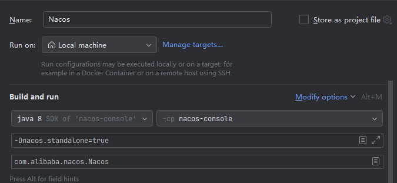
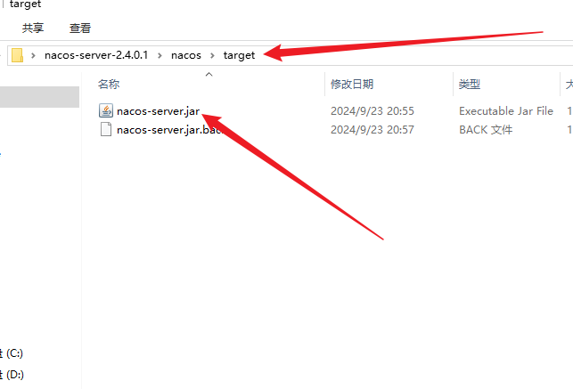

# nacos数据源更改达梦数据库

- ## idea运行方式
1. ### 运行前maven先clean再compile，因为有一个包需要编译时才会生产，如果不先compile就启动就会报包缺失。
2. ### 因为nacos默认是集群模式，所以我们启动必须指定单机模式运行，否则会报错，必须在运行前编辑配置新增一个 *-Dnacos.standalone=true* 参数。   

- ## jar包运行方式
### 这里需要借助官方的包运行，官方写好了运行文件，里面配置好了单机运行，所以先去[官网](https://github.com/alibaba/nacos/releases/tag/2.4.0.1)下载对应版本的zip包，然后解压替换它里面的jar包，同时修改我们的jar包名为nacos-server.jar，然后进入bin目录下，按下面的方式执行对应命令。
### Linux/Unix/Mac 启动命令(standalone代表着单机模式运行，非集群模式):
    sh startup.sh -m standalone
### 如果您使用的是ubuntu系统，或者运行脚本报错提示[[符号找不到，可尝试如下运行：
    bash startup.sh -m standalone
### Windows 启动命令(standalone代表着单机模式运行，非集群模式):
    startup.cmd -m standalone

